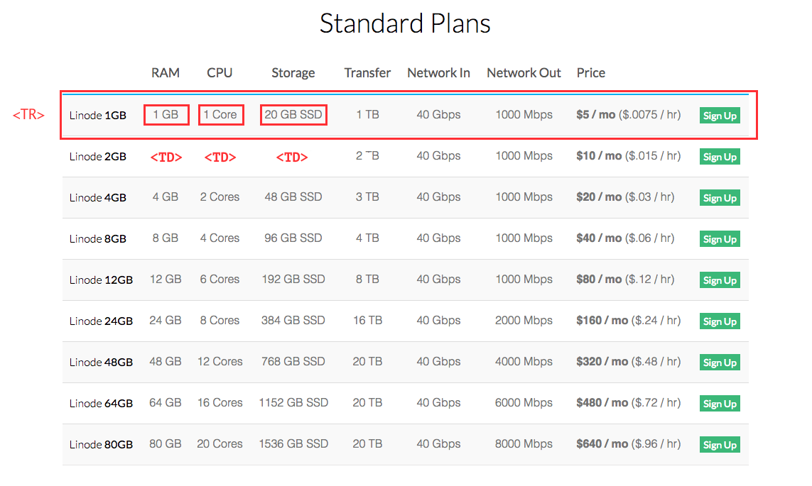
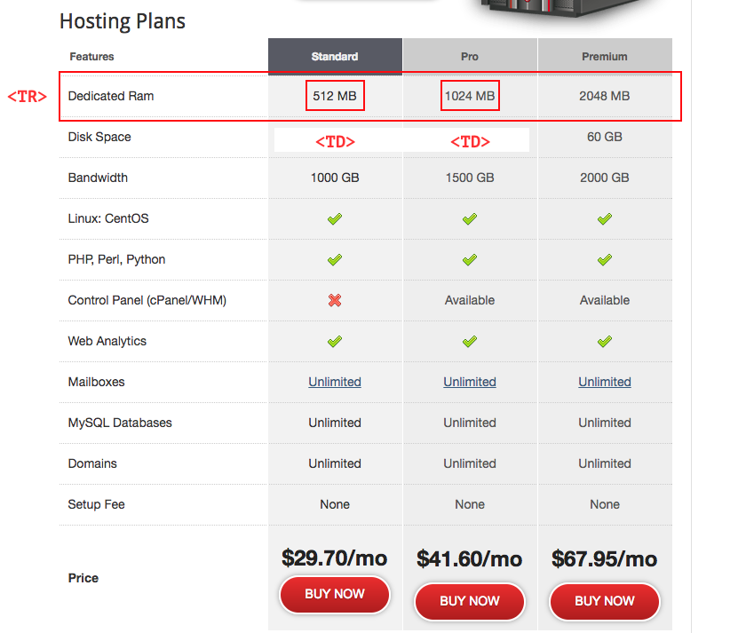

# 如何抓取结构复杂的 VPS Plan
## Plan 分类
由于不同厂商使用不同的网站，所以他们的 Plan 表也是不一样的，为了能设计出一套通用的解析器，我们先研究下它们的特点：  

### 第一种
  
Linode: 像这样的情况属于多数，一个节点包含了一个完整的 Plan  

### 第二种
  
DomainVPS: 这种就比较反直觉了，一个好好的 Plan 被分割到不同的节点里，简直是 VPS 中的杀马特  


## Plan 解析器逻辑（配置表）
为了避免给每一个网站写一个 spider，有必要设计一套配置表，通过配置表来告诉解析器不同的网站应该怎么解析  

```python
{
    'https://www.linode.com/pricing': PlanSet([
        (('#pricing-larger-plans > div > div > div > div > table > tbody > tr', 'td'), {
            0: values.Name,
            1: values.RAM,
            2: values.CPU,
            3: values.Disk,
            4: values.Traffic,
            5: values.NetworkIn,
            6: values.NetworkOut,
            7: values.Price,
        }),
    ]),
}
```
如代码如示，这个是 Linode 的配置表，这个配置表结构简单，却具有相当的可扩展性和通用性。  
- `https://www.linode.com/pricing`: 此项指示 Plan 所在页面
- `PlanSet`: 此类封装了对配置表的解析逻辑，下面是具体的参数
- `#pricing-larger-plans > div > div > div > div > table > tbody > tr`: 此 CSS Selector 指示了 Plan 所在节点，若使用 $() 去 select 就会发现，它会返回一个 tr 列表，其中每一个元素都包含一个 Plan
- `td`: 此 CSS Selector 指示了具体 Specs 所在节点，其返回结果也是数组
- `{0: values.Name, 1: values.RAM, ...}`: 此项是在遍历 Specs 时 DOM数组 对 values.\* 的映射关系，其 key 对应了上一步中数组的下标
- `values.CPU`: 此类是封装好的 Specs 解析单元，主要是针对常见的格式，比如 `1 cores`, `1 CPU 2.6 GHz` 等进行解析。一般会提取出有用的信息，比如 `1 CPU 2.6 GHz` 中会提取成 {'core': 1, 'freq': 2.6, 'freq_unit': 'GHz'}

以上代码运行后会得到一个数组：[Plan, Plan, Plan, ...]  
其中每个 Plan 里都包含了 Specs 解析单元 的实例  

### 对 Plan 表格中 DOM 结构的预处理
上面的代码只是说明了处理正确表结构的情况，然而现实中有大量表结构是不正常的，那么这种不正常的表，应该如何写配置呢？  

如下所示，为 DomainVPS 的配置表：

```
{
    'http://www.domain.com/hosting/vps/': PlanSet([
        (('#main > div.compgrid > table > tr', 'td', True), {
            1: values.Disk,
            2: values.Traffic,
            11: values.Price,
        }),
        (('#main > div.compgrid > table > tr', 'th', True)), {
            0: values.Name,
        }),
    ]),
}
```
- `True`: 大家可以看到在第2个 CSS Selector 后面还跟了个参数。这个参数的意思是，此表结构非主流，需要预处理，在获取 DOM数组 后进行转换
- `values.Name`: 这里，Name 被分到另一组 CSS Selector 中处理。如果大家查看该 HTML 的元素，就会发现，Name 所在节点跟其他 Specs 所在节点的种类不是同一个, 甚至很多情况下，Name, Price 的DOM结构跟 其他Specs 的DOM结构是很不一样的，所以配置表的这种特性就可以很好地解决这个问题。 

### 对特殊 Specs 的特别处理
除了 Plan表格 会出现特殊结构外，有些奇葩厂商还会弄些标新立异的 Specs 格式。比如：  

- 同一个表格中 Disk 的格式不一样，一种是 "10 GB", 另一种是 "2x 30 GB"
- 同一个表格中 Traffic 的格式不一样，一种是 "100.000 Gbps", 另一种是 "100,000 Gbps"

像这样的情况，我会这样处理：  
```python
{
    'http://xxx.ooo': PlanSet([
        (('#main > div.compgrid > table > tr', 'td', True), {
            1: ValueMatch(values.Disk, re.compile("((?P<disk_cnt>\d+)x ?)?(?P<size>\d+)(?P<size_unit>\w+) (?P<disk_type>SSD)")),
            3: ValuePipe(values.Traffic, 
                         [ lambda t: t.replace(',', '').replace('.', '') + ' GB'],
                         values.Traffic
                ),
        }),
    ]),
}
```

- `ValueMatch(value_class, regex)`: 使用 regex 对特殊格式进行识别，识别的结果是一个dict, 里面的 key 直接就是 values.Disk 的字段
- `ValuePipe(value_class, pre_process, value_class)`: 在使用 value_class 自带的解析单元进行解析之前，先用 pre_process 把 Specs 处理下，这里，我把 ',' 替换成 '.', 方便后续的识别

更多配置案例请移步至: [urlsolutions.py](vps/libs/solution/urlsolutions.py)
